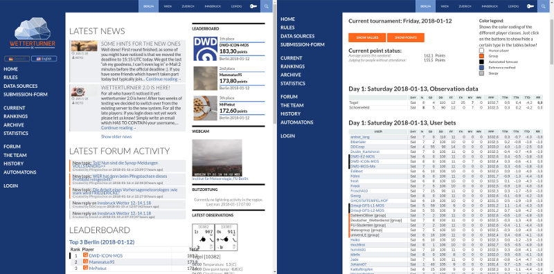

What is "Wetterturnier"
-----------------------

The "Berliner Wetterturnier" as it has been known as in the beginning was
launched in the year 2000 at the Institute of Meteorology at the FU Berlin.
Since 2005 five cities in Central Europe are included.

`Wetterturnier <http://wetterturnier.de>`_ is a platform where *hobby meteorologists*,
*experts* and *statistical forecast model developer* battle against each other. The
goal is to predict a set of meteorological variables, such as sunshine duration, wind speed,
or temperature as good as possible for the consecutive two days.

*This plugin is the frontend core* of the whole system providing full wordpress integration
(user management, messaging services, forums) and the platform where our users can *submit
their forecasts/bets*. Furthermore this plugin provides live ranking tables, a leader-board,
a data archive, and access to a set of important data sets such as observations and forecast maps.

Please note that this is only one part of the system. To get the whole system running
the `Wetterturnier backend <https://github.com/retostauffer/wetterturnier-backend>`_
is needed which prepares the observations, computes mean bets for specific groups, and
computes the points for the ranking system.
